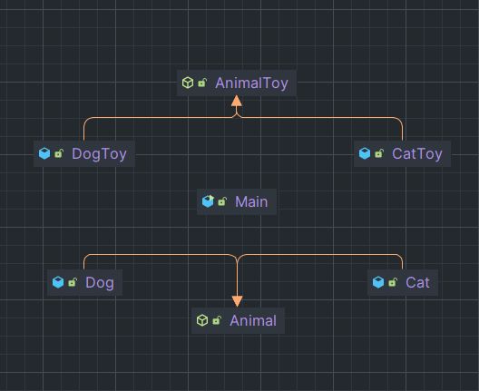

> "Override 된 메서드가 객체를 반환하는 패턴" 출처 - Spring 입문

Factory는 공장을 의미한다. 공장은 물건을 생산하는데 객체 지향에서 팩터리는 **객체를 생성한다.**

팩터리 메서드 패턴은 객체를 생성 반환하는 메서드를 의미한다. 여기에서 패턴이 붙는다면, 하위 클래스에서 팩터리 메서드를 
오버라이딩해서 객체를 반환하는 것을 의미한다.

코드는 code directory 부분에 넣어둔다.

---

인스턴스 생성을 Sub 클래스에게 위임한다. 

Super Abstract Class는 Interface에만 의존, 실제로 어떤 구현 클래스를 호출할지는 Sub Class에서 선택.

이렇게 될 경우, 새로운 구현 클래스가 추가되어도 기존 Factory 코드의 수정 없이 새로운 Factory 를 추가하면 된다.

**때문에 수정에는 닫혀 있고, 확장에는 열려있는 OCP 원칙을 지킬 수 있다는 점, DIP도 사용하고 있다.**

간단한 기능을 사용할 때보다 많은 클래스를 정의하고 사용하기에 복잡도는 높다는 점이 단점이다.

