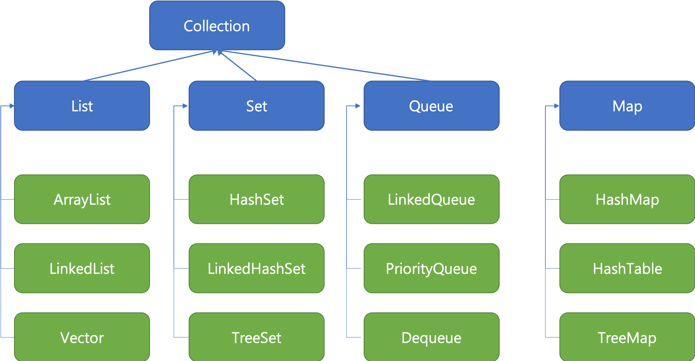

## Collection Framework

다수의 데이터를 쉽고 효과적으로 처리할 수 있는 표준화된 방법을 제공하는 Class의 집합을 의미한다.

데이터를 저장하는 자료구조와 처리하는 자료구조를 구조화하여 Class로 구현해 놓은 것이다.

List - Set - Map 구조상 차이로 List와 Set은 Collection을 확장하지만, Map은 별도로 정의했다.

### List

- 순서가 있는 데이터의 집합이다.
- 주로 ArrayList를 구현한다. (간혹가다 LinkedList도 구현)

### Set

- 순서가 없는 데이터의 집합이다. 
- 중복을 허용하지 않는다. (중복 제거)
- TreeSet이나 LinkedSet의 경우 순서를 보장한다.

### Map

- Key - Value의 데이터 형식으로 저장이 된다.
- 순서가 없다.
- Key는 중복이 허용되지 않지만, Value는 중복이 허용된다. (key - 해시충돌)
- TreeMap이나 LinkedHashMap의 경우는 순서를 보장한다.
