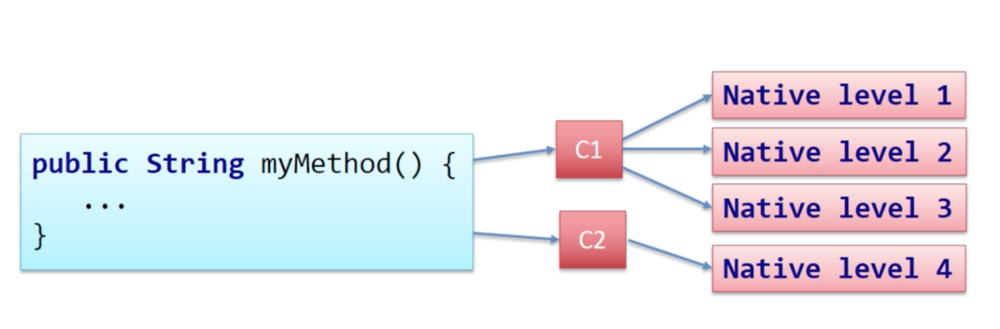

## JVM

### JVM이란 무엇인가 ?
JVM이란 Java byte Code를 실행할 수 있는 Runtime 환경을 제공하는
가상 머신을 의미한다.

JVM은 Java compiler(javac)에 의해 변환된 class file인 Java byte code(.class) 로더(Class Loader)를 통해
로드하고, Java 실행 엔진(Execution Engine)을 통해 실행한다.

JVM의 **장점은 Code 호환성**이 좋다는 것이다. Java Byte Code는 한 번 작성되면 여러 플랫폼에서 실행이 가능하다.
**Java Byte Code는 JVM 위에서 실행되어 특정 하드웨어에 종속되지 않는다.**

JVM의 **단점은 실행 속도 문제**가 있다. 소스 코드에서 Byte Code로 변환한 다음 Byte Code에서 실행 가능한 Code로 변환해야 하므로, 다른 언어에 비해 프로그램
실행속도가 떨어진다.

하지만 **JIT Compiler를 사용하면 기본적으로 인터프리터 방식으로 기계어 Code를 생성하면서 그 Code를 캐싱**하여 같은 함수가 여러 번 불릴 때, JIT
Compiler가 매번 기계어 Code를 생성하는 것을 방지해 성능 문제를 해결할 수 있다.

### JVM, JRE, JDK를 각각 간략하게 설명할 수 있는가 ?

JVM은 Java source Code로부터 만들어진 Java Binary File인 .class file을 실행하도록 하는 가상 머신을 의미한다.

JRE는 Java Runtime Environment 의 약자로, Java 실행 환경을 의미하며, JVM을 동작하는 데에 필요한 각종 Java 라이브러리를 담고 있다.

JDK는 Java Development Kit의 약자로, JRE와 javac 등의 Compiler, 디버거 등을 포함한다.

### JVM Memory 구조에 대해 설명할 수 있는가 ?

JVM Memory 구조는 총 5가지이다.

1. Method Area (메서드 영역) : 클래스 변수의 이름, 타입, 접근제어자 등과 같은 class와 관련된 정보를 저장한다.
그 외에도 static 변수, interface 등을 저장한다. 또한, 모든 Thread에서 공유하며, JVM 시작 시 생성되고 프로그램 종료까지 유지한다.
2. Heap Area (힙 영역) : new를 통해서 생성된 객체와 배열의 인스턴스를 저장하는 곳이다. 힙 영역에서 생성된 객체는 스택 영역의 변수나 다른 객체의
필드에서 참조한다. 명시적으로 null, 참조되지 않는 객체는 GC의 대상이 된다.
3. Stack Area (스택 영역) : 메서드가 실행되면 스택 영역에 메서드에 대한 영역이 1개 생성된다. 스택 영역에서는
지역 변수, 매개 변수, 리턴 값 등을 저장한다. 메서드가 호출될 때마다 프레임이라 불리는 영역으로 할당되며 프레임 별로 관리된다.
Primitive Type은 바로 스택영역에 저장되며, 그 외에는 힙 영역이나 메서드 영역의 객체 주소를 저장한다.
4. PC register : Thread가 시작될 때 생성되며, 현재 Thread가 실행되는 부분의 주소와 명령을 저장한다.
5. Native Method Stack : Java 이외의 언어로 작성된 코드를 위한 메모리 영역이다. JNI(Java Native Interface)에 의해 실행된다.

### Heap 영역에서 참조되지 않는 객체는 GC의 대상이 된다는데, Heap 영역에 대해 GC관련해서 설명할 수 있는가 ?

Heap 영역은 크게 Young Generation, Old Generation 으로 나뉜다.

Young Generation은 새롭게 생성한 객체들이 위치한다.

대부분의 객체는 금방 접근 불가능한 상태가 되기 때문에, 많은 객체가 Young 영역에 생성되어 있다가 사라진다.

Young Generation은 Eden과 Suvivor 1, 2로 이루어져 있다. 이 때, Eden은 Object가 Heap에 최초로 할당되는 장소이며
Eden 영역이 꽉차면 Survivor 영역으로 넘어가게 된다. 1과 2 영역이 채워지게 되면, 살아남은 객체는 비워진 Survivor로 이동한다.
이때 **참조가 없는 객체들은 Minor GC**로 수집된다. 따라서 항상 Survivor1과 2 중 한 곳은 비어있는 상태가 된다.

Old Generation은 Young 영역에서 계속 사용되어 살아남은 객체가 복사되는 영역이다.

Young 영역보다 크게 할당되며, Major GC가 이루어지며, Minor GC보다 횟수가 적다.
(Major GC는 Old, Minor GC는 Young이다. Major GC는 _**Permanent**_ 영역에서 발생하는 GC를 말한다.)

> Permanent : Class, Method 등의 Code등이 저장되는 영역으로 JVM에 의해 사용됩니다. 
> 
> 또한, Java 8 부터는 Permanent Generation 메모리 영역이 없어지고 Metaspace 영역이 생겼습니다.
> 
> 기존의 Permanent영역은 Heap영역에 있었지만, Metaspace영역은 Native 메모리 영역에 위치합니다.
> 
> 그리고 Permanent영역은 Default로 제한된 크기를 갖고있었으나, Metaspace영역은 제한된 크기를 가지고 있지 않아 필요한 만큼 계속 늘어납니다.
> 
> 그 결과 Permanent영역이 Metaspace영역으로 변경되면서 더 큰 메모리 영역을 사용할 수 있게 되었습니다.

### JIT Compiler가 무엇인가 ?

Java에서 SourceCode는 javac compiler에 의해 Byte Code로 변환되며
JVM은 Byte Code를 실행하므로써 Java Code로 작성된 Application이 동작을 수행하게 된다.

이때 Byte Code는 인터프리터에 의해 기계어 Code로 변환되어 실행되는데 JIT Compiler는 빈번하게 혹은 반복적으로 사용되는 Code들에 대해서
매번 인터프리터에 의해 기계어로 변환되지 않고 바로 사용할 수 있도록 기계어 Code로 변환하여 Code의 수행시간에 최적화를 제공하게 된다. (캐싱의 개념이 아니다.)

### 그렇다면 JIT Compiler는 어떤 기준을 통해 최적화할 Code를 정하는가 ?

각 메서드는 **Invocation 카운터와 Back Edge 카운터**를 가지고 있다.
JIT Compiler는 이를 통해 어떤 Code를 최적화할지 결정하게 된다.

Invocation 카운터의 경우 **메서드를 시작할 때마다 카운터 값이 하나씩 증가**하게 되며 `XX:CompileThreshold` JVM 옵션에 설정된 값만큼 메서드가 호출될 때
인터프리터에 의해 JIT Compiler로 Compile을 요청하게 된다.

Back Edge 카운터의 경우 높은 Byte Code Index에서 낮은 Byte Code Index로 흐름이 변경될 때마다 증가하게 된다.
즉 **반복문을 수행할 때마다 카운터 값이 하나씩 증가**한다. Back Edge 카운터는 `XX:CompileThreshold`와 `XX:OnStackReplacePercentage`라는 두 가지 JVM
옵션의 설정 값을 통해 Compile 대상을 설정하는데, 이는 `CompileThreshold * OnStackReplacePercentage / 100`으로 구할 수 있다.

해당 값만큼 반복문을 수행할 때 인터프리터에 의해 JIT Compile을 요청하게 된다.

### JIT Compiler의 종류 중에서 C1, C2 Compiler에 대해 설명할 수 있는가 ?

기본적으로 JIT Compiler는 두 개가 있다.

- C1은 Level 1 ~ 3를 담당한다. C2는 Level 4를 담당하게 된다. 이 레벨 체계를 Compilation tier라 부른다.
- JVM은 해당 코드 블록이 어느 Compiler를 사용할지를 `코드의 사용 빈도`, `Complexity / time consuming`을 토대로 결정한다.
-> 이 작업을 `Profiling`이라 한다.
  - 기본적으로 C1 Compiler를 사용하되, Level 4에 도달하면 C2를 사용한다. C2는 C1보다 더 최적화된 Code를 사용한다.
  - 또한 JVM에서 해당 Code를 Code Cache에 저장할지를 결정한다.(Special Area Of Memory -> To Access Quickest Way)
- 모든 Code를 Level 4단계로 Compile 하지는 않는다. 자주 쓰인다 해도, Complex한 작업을 담당하는 Code가 아니라면, 굳이 Code Cache에 넣지 않는다. (Code Cache까지 집어 넣었을 때의 이점이 별로 없다.)

C1 Compiler는 C2 Compiler보다 Compile 시간도 더 짧고 단순하게 설계되었다. C2 Compiler에서는 Compile 시간이 C1 Compile 시간보다 상대적으로 길지만
더 높은 수준의 최적화를 지원한다.

**C1은 속도, C2는 최적화에 조금 더 집중되어 있다.**

