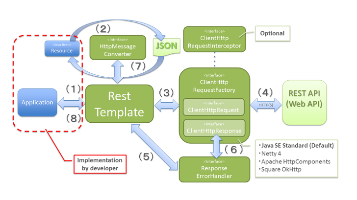

# RestTemplate ?

> ObjectMapper 에 이어서 RestTemplate를 알아보고자 한다.

RestTemplate는 Spring에서 지원하는 객체로 간편하게 RestAPI를 호출할 수 있는 Spring 내장 클래스이다.

Spring 3.0부터 지원되었으며 Json, XML 응답을 모두 받을 수 있다. Spring의 HTTP 통신 템플릿이다.

그리고 Blocking I/O 기반의 동기방식을 사용하는 템플릿이며 RESTful 형식에 맞춰진 템플릿이다.

Header, Content-Type 등 설정하여 외부 API를 호출할 수 있다. Server - Server 에 사용된다.

### RestTemplate 동작 원리 

1. 어플리케이션이 RestTemplate를 생성하고, URI, HTTP메소드 등의 헤더를 담아 요청한다.
2. RestTemplate 는 HttpMessageConverter 를 사용하여 requestEntity 를 요청메세지로 변환한다.
3. RestTemplate 는 ClientHttpRequestFactory 로 부터 ClientHttpRequest 를 가져와서 요청을 보낸다.
4. ClientHttpRequest 는 요청메세지를 만들어 HTTP 프로토콜을 통해 서버와 통신한다.
5. RestTemplate 는 ResponseErrorHandler 로 오류를 확인하고 있다면 처리로직을 태운다.
6. ResponseErrorHandler 는 오류가 있다면 ClientHttpResponse 에서 응답데이터를 가져와서 처리한다.
7. RestTemplate 는 HttpMessageConverter 를 이용해서 응답메세지를 java object(Class responseType) 로 변환한다.
8. 어플리케이션에 반환된다.

출처 : https://sjh836.tistory.com/141