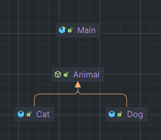

> "Override 된 메서드가 객체를 반환하는 패턴" 출처 - Spring 입문 

템플릿 메서드 패턴은 위의 한 문장으로 기억하면 좋다. GoF Design Patterns 의 정의는 아래와 같다.

> Defines the skeleton of an algorithm in a method, deferring some steps to subclasses. Template Method lets subclasses redefine certain steps of an algorithm without changing the algorithms structure.

알고리즘의 구조를 메서드에 정의, 서브 클래스에서 알고리즘의 구조의 **변경없이** 알고리즘을 재정의 한다.

알고리즘이 단계별로 이루어지거나, 같은 역할을 하는 메서드이지만 여러 곳에서 다른 형태로 사용이 필요한 경우 사용하면 좋은 패턴이다.

코드의 로직 부분은 code directory 부분에 남겨 둔다. 

---

상위 클래스에 공통 로직을 수행하는 템플릿 메서드와 하위 클래스에 오버라이딩을 강제하는 추상메서드 또는 선택적으로 오버라이딩을 할 수 있는
훅 메서드를 두는 패턴을 템플릿 메서드 패턴이라 한다.

