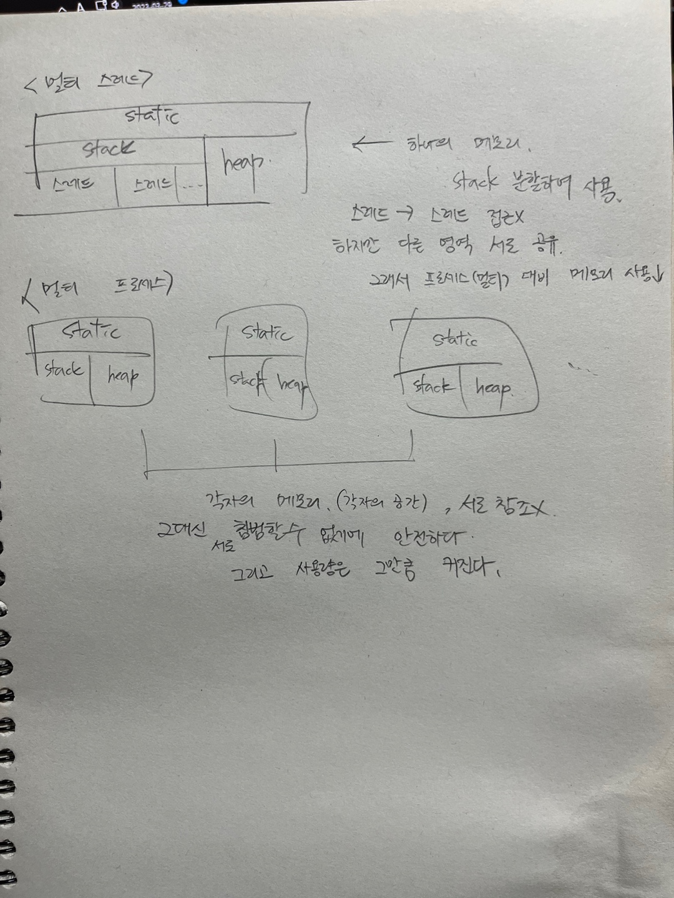

멀티 스레드와 멀티 프로세스의 명확한 차이.

(웹) 서블릿은 요청당 프로세스가 아닌 스레드를 생성한다.

요청당 스레드(서블릿)가 요청당 프로세스(CGI)보다 왜 더 효율적인가?

보다 더 적은 메모리로 서로 간의 공유하는 영역이 있기에 효율적일까? 그렇다면 
프로세스는 서로 메모리 간의 (각자의 공간 간의) 침범이 불가능해서 안전하다는데

그렇다면 멀티 스레드는 안전하지 못한다라는 말이 되는 것인지.?? 이렇게 생각해보면 멀티 스레드가 꼭 장점만이 있는 건 아닌 거 같고..??

### 멀티 스레드에서 전역 변수 사용의 문제점 ?

두 개의 스레드(1, 2)가 있다고 하고, 전역변수(A)를 사용해서 생각해 보면

스레드들끼리 스태틱영역과 힙 영역은 공유할 테니 전역변수도 공유할 것. 

1에서 먼저 A = 10 이라는 값을 할당했고, 컨텍스트 스위칭으로 2에서 A = 20 이라는 값을 할당하여 종료.
다시 넘어가 1에서 A를 출력하려니 A = 20이라는 값이 나와버려 문제점 발생

이런 점을 스레드의 안전성이 깨진다고 표현함. 락(Lock)을 거는 것도 한 방법이지만 이는 멀티 스레드의 장점을 버린 것과 같음.

멀티 스레드를 조금 더 알아보자. (Start6 클래스 참조)

해당 클래스를 run 해봤을 경우에 나타나는 값은 제각각 달랐다. 

공유 변수를 참조해 서로 다른 스레드들이 1초간 간격으로 더해가는 과정에서 
위와 같은 상황이 발생하는 것이다. (race condition 발생 ? )

### 가장 중요한 것 (3줄 요약)
* 스태틱 영역 ? 클래스의 놀이터
* 스택 영역 ? 메서드의 놀이터
* 힙 영역 ? 객체의 놀이터